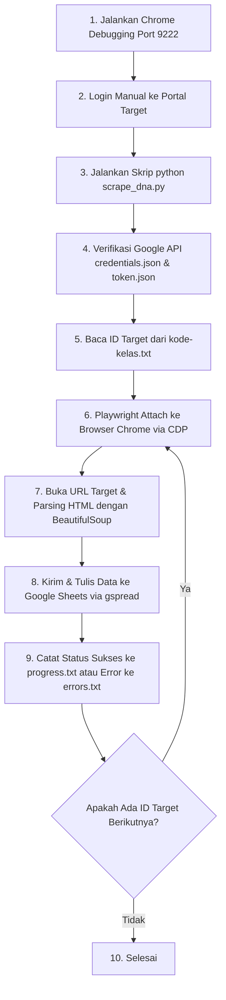

# Web Scraping dengan Chrome DevTools Protocol (CDP) & Google Sheets

Repository ini dirancang untuk mendokumentasikan dan memfasilitasi replikasi serta adaptasi proyek web scraping berbasis **Chrome DevTools Protocol (CDP)**. Metode ini sangat efektif untuk mengambil data tabel dari portal web yang dilindungi oleh otentikasi login (Single Sign-On / SSO) dan sistem keamanan anti-bot (seperti Cloudflare atau Turnstile) yang biasanya memblokir bot otomatis standar (misal: Playwright headless biasa atau Selenium).

---

## 1. Prasyarat (Prerequisites)

Untuk menjalankan atau mereproduksi project ini, Anda perlu menyiapkan lingkungan kerja baik secara offline (lokal) maupun online (cloud).

### A. Prasyarat Offline (Lingkungan Lokal)
*   **Google Chrome**: Browser Google Chrome asli terinstal di komputer lokal Anda.
*   **Package & Environment Manager Python:**
    *   [Conda](https://docs.conda.io/): Untuk membuat environment terisolasi yang stabil.
    *   [uv](https://github.com/astral-sh/uv): Package manager Python alternatif yang sangat cepat untuk menginstal dependensi.
*   **Python 3.8+**: Bahasa pemrograman utama untuk menjalankan skrip scraping. Biasanya akan terinstal bersamaan dengan Conda.
*   **AI Developer Tools (Opsional):**
    *   Program asisten AI seperti **Antigravity CLI**, **Claude Code**, atau **Codex** untuk memandu jalannya eksekusi, modifikasi kode, maupun porting skrip ke website target baru.

### B. Prasyarat Online (Layanan Cloud)
*   **Google Cloud Console Project**:
    *   Akses ke [Google Cloud Console](https://console.cloud.google.com/).
    *   Mengaktifkan **Google Sheets API** dan **Google Drive API** pada project Anda.
    *   Membuat kredensial **OAuth 2.0 Client ID** dengan tipe aplikasi **Desktop Application**.
*   **Google Sheets**:
    *   Sebuah spreadsheet kosong untuk menampung data hasil scraping.
    *   Dapatkan **Spreadsheet ID** yang tertera pada URL lembar kerja Anda (misal: `https://docs.google.com/spreadsheets/d/ID_SPREADSHEET_ANDA/edit`).

### C. File-File Yang Harus Disediakan
Sebelum menjalankan skrip scraper, pastikan berkas-berkas berikut telah tersedia di direktori root project:

1.  **`credentials.json`**: Berkas konfigurasi kredensial OAuth 2.0 yang diunduh dari Google Cloud Console. Berkas ini digunakan untuk otentikasi awal ke API Google.
2.  **`kode-kelas.txt`**: Berkas teks yang berisi daftar kode kelas atau ID unik target scraping, dengan ketentuan satu ID per baris.
3.  **`requirements.txt`**: Berkas yang mendaftarkan pustaka Python yang wajib diinstal. Contoh isinya:
    ```text
    playwright
    gspread
    beautifulsoup4
    ```

---

## 2. Cara Kerja (Framework) Umum Project

Alur kerja project ini menggabungkan kekuatan kendali browser manual dan otomatisasi backend. Berikut adalah framework umum jalannya proses scraping:



### Rincian Alur Kerja:

1.  **Menjalankan Browser Chrome dalam Mode Debugging:**
    Semua jendela Chrome ditutup terlebih dahulu, lalu Chrome dijalankan melalui terminal dengan port debugging terbuka (default: `9222`) menggunakan parameter `--remote-debugging-port=9222` dan folder profil baru `--user-data-dir`. Hal ini memicu Chrome untuk berjalan dengan port kontrol CDP yang dapat diakses skrip luar.
2.  **Otentikasi Login Manual:**
    Pengguna membuka website target (misalnya portal SIAKAD) di Chrome debugging tersebut dan melakukan login secara manual. Keuntungannya adalah skrip tidak perlu menangani proses login yang rumit atau bypass multi-factor authentication (MFA).
3.  **Koneksi dan Otomatisasi Playwright via CDP:**
    Saat skrip Python dijalankan, Playwright tidak membuka browser baru, melainkan melakukan *attach* ke browser Chrome yang sudah terbuka di port `9222`. Browser ini memiliki sidik jari (*fingerprint*) manusia asli dan sesi login yang aktif.
4.  **Ekstraksi Data (Scraping):**
    Skrip membaca satu per satu ID target dari `kode-kelas.txt`, mengarahkan browser debug ke halaman tersebut, lalu mengambil konten HTML. Pustaka **BeautifulSoup** digunakan untuk mem-parsing data tabel secara lokal di backend Python.
5.  **Penyimpanan Real-Time ke Google Sheets:**
    Data hasil parsing langsung dikirim ke API Google Sheets menggunakan pustaka `gspread` secara asinkron/real-time. Token akses disimpan di `token.json` agar otentikasi berikutnya tidak memerlukan persetujuan ulang.
6.  **Pencatatan Progress & Ketahanan Kesalahan (Resilience):**
    ID yang berhasil diproses dicatat ke `progress.txt`, sedangkan yang gagal dicatat ke `errors.txt`. Jika skrip terhenti atau koneksi terputus di tengah jalan, skrip dapat membaca `progress.txt` untuk melanjutkan pekerjaan tanpa mengulang dari awal (*resume capability*). Jika muncul tantangan bot captcha yang tidak terduga, skrip akan menjeda otomatis dan meminta interaksi manusia untuk menyelesaikan captcha sebelum menekan Enter di terminal untuk melanjutkan.
